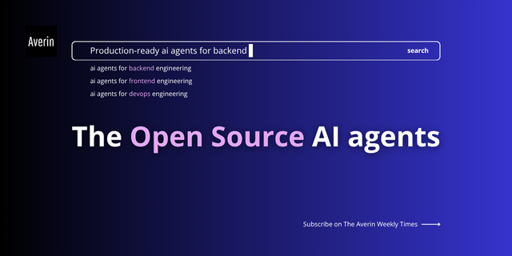

# Averin AI Agents



A comprehensive collection of specialized AI agent prompts and configurations for software development, articles writing, DevOps, security, architecture, and content creation workflows.

## Overview

This repository provides production-ready AI agent specifications designed to enhance development workflows, automate complex tasks, and maintain high-quality standards across various technical domains. Each agent is carefully crafted with specific expertise, responsibilities, and integration points.

## Project Structure

```
agents/                        # Universal agents (work with any AI tool)
├── orchestrator_agent.md
├── journalist_critical_thinking_agent.md
├── software_engineering_and_architect_agent.md
├── devops_cloud_infrastructure_agent.md
├── english_grammar_editorial_style_agent.md
├── content_classifier_agent.md
├── dotnet_csharp_expert_agent.md
└── journalist_agent_user_prompt_template.md

copilot/                       # GitHub Copilot optimized agents
└── instructions/              # Ready to use with Copilot

cursor/                        # Cursor AI optimized agents
└── rules/                     # .cursorrules format

claude/                        # Claude (Anthropic) optimized agents
└── prompts/                   # CLI and API ready prompts

gemini/                        # Google Gemini optimized agents
└── configs/                   # CLI configurations

continue/                      # Continue.dev optimized agents
└── configs/                   # Config snippets

aider/                         # Aider optimized agents
└── prompts/                   # Git-aware prompts

cody/                          # Sourcegraph Cody optimized agents
└── recipes/                   # Custom commands and recipes
```

## Available Agents

### Universal Agents (agents/)

These agents work with **any AI tool**. Simply copy the content and use with your preferred AI assistant.

Browse the [agents/](agents/) folder to see all available agents. Each agent is a self-contained markdown file ready to use with any AI coding assistant.

**Current categories:**
- Content creation and editorial workflows
- Backend development (.NET, Python, Java, etc.)
- Frontend development
- DevOps and infrastructure
- Security and compliance
- Architecture and design
- And more...

### GitHub Copilot Agents (copilot/)

Optimized for GitHub Copilot with VS Code integration, @-mentions, and slash commands.

*More agents coming soon to this section*

## Planned Agent Categories

We're building a comprehensive ecosystem of AI agents across multiple domains:

### Development
- Backend Development Agent
- Frontend Development Agent
- Full Stack Development Agent
- API Design & Integration Agent

### Architecture & Design
- Software Architecture Agent
- System Design Agent
- Microservices Architecture Agent
- Domain-Driven Design Agent

### DevOps & Infrastructure
- CI/CD Pipeline Agent
- Container & Kubernetes Agent
- Cloud Platform Agent (AWS/Azure/GCP)
- Infrastructure as Code Agent

### Security
- Security Audit Agent
- Penetration Testing Agent
- Secure Code Review Agent
- Compliance & Standards Agent

### Data & Databases
- Database Design Agent
- SQL Optimization Agent
- NoSQL Strategy Agent
- Data Migration Agent

### Quality & Testing
- Test Strategy Agent
- Code Review Agent
- Performance Testing Agent
- Quality Assurance Agent

## Multi-Tool Compatibility

This repository is organized to support **any AI coding assistant**:

### agents/ - Universal Agents
Generic prompts that work with **any tool**: GitHub Copilot, Cursor, Claude CLI, Gemini CLI, Continue.dev, Aider, Cody, and more. Simply copy and paste the content into your AI tool of choice.

### copilot/ - GitHub Copilot Specific
Agents optimized specifically for GitHub Copilot, leveraging VS Code integration, @-mentions, slash commands, and Copilot-specific features.

### cursor/ - Cursor AI Specific
Agents optimized for Cursor with .cursorrules format, Composer mode, and @-mentions for multi-file editing.

### claude/ - Claude (Anthropic) Specific
Agents optimized for Claude CLI and API, with detailed system prompts and MCP (Model Context Protocol) configurations.

### gemini/ - Google Gemini Specific
Agents optimized for Gemini CLI with system instructions, context caching, and function calling support.

### continue/ - Continue.dev Specific
Config snippets for Continue.dev with custom slash commands, context providers, and LLM-agnostic configurations.

### aider/ - Aider Specific
Git-aware prompts optimized for Aider's pair programming workflow with automatic commit integration.

### cody/ - Sourcegraph Cody Specific
Custom recipes and commands leveraging Cody's code graph awareness and enterprise context capabilities.

Each tool-specific folder contains agents optimized for that platform's unique features and limitations.

## Getting Started

### Quick Start with Universal Agents

1. **Browse the [agents/](agents/) folder**
2. **Choose an agent** that matches your needs
3. **Copy the entire content** of the agent file
4. **Paste into your AI tool**:
   - GitHub Copilot: Create `.github/copilot-instructions.md` and paste
   - Cursor: Create or edit `.cursorrules` and paste
   - Claude CLI: Use `claude --system-prompt "$(cat agent-file.md)"`
   - Any other tool: Paste as system prompt or instructions

### Quick Start with Tool-Specific Agents

#### GitHub Copilot
1. Navigate to `copilot/instructions/`
2. Choose an agent
3. Copy to your project: `cp copilot/instructions/agent-name.md .github/copilot-instructions.md`
4. Restart VS Code

#### Cursor
1. Navigate to `cursor/rules/`
2. Choose an agent
3. Copy to your project: `cp cursor/rules/agent-name.cursorrules .cursorrules`
4. Restart Cursor

#### Claude CLI
1. Navigate to `claude/prompts/`
2. Choose an agent
3. Use with CLI: `claude --system-prompt claude/prompts/agent-name.txt`
4. Or integrate with your scripts

#### Gemini CLI
1. Navigate to `gemini/configs/`
2. Choose an agent
3. Use with CLI: `gemini --system-instruction gemini/configs/agent-name.txt`
4. Or use YAML config files

#### Continue.dev
1. Navigate to `continue/configs/`
2. Choose an agent configuration
3. Add to your `~/.continue/config.json`
4. Restart VS Code

#### Aider
1. Navigate to `aider/prompts/`
2. Choose an agent
3. Use with Aider: `aider --architect --system aider/prompts/agent-name.txt`
4. Leverage git integration

#### Cody
1. Navigate to `cody/recipes/`
2. Choose a custom recipe
3. Add to your `.vscode/cody.json`
4. Use custom commands in Cody

### Example: Using the .NET C# Expert Agent

```bash
# Universal approach (works with any tool)
# Copy the content from agents/dotnet_csharp_expert_agent.md

# With GitHub Copilot (when specific version available)
cp copilot/instructions/dotnet-expert.md .github/copilot-instructions.md

# With Claude CLI
claude --system-prompt agents/dotnet_csharp_expert_agent.md

# With Cursor
cat agents/dotnet_csharp_expert_agent.md >> .cursorrules
```

## Agent Structure

### Universal Agents (agents/)
- **Single markdown file** per agent
- Works with any AI tool
- Copy-paste ready
- Comprehensive and self-contained

### Tool-Specific Agents (copilot/, cursor/, claude/, etc.)
- **Optimized format** for each platform
- Leverages tool-specific features
- Ready-to-use configuration files
- Installation instructions included

### Available Tool-Specific Folders
- **copilot/** - GitHub Copilot (.github/copilot-instructions.md format)
- **cursor/** - Cursor AI (.cursorrules format)
- **claude/** - Claude CLI/API (system prompts, MCP configs)
- **gemini/** - Google Gemini CLI (system instructions, YAML configs)
- **continue/** - Continue.dev (JSON config snippets)
- **aider/** - Aider (git-aware prompts)
- **cody/** - Sourcegraph Cody (custom recipes/commands)

## How to Use Agents

### With Universal Agents
1. Open the agent file in `agents/`
2. Copy the entire content
3. Use with your AI tool:
   - **GitHub Copilot**: Paste into `.github/copilot-instructions.md`
   - **Cursor**: Paste into `.cursorrules`
   - **Claude CLI**: Save as text file and use with `--system-prompt`
   - **Gemini CLI**: Use with `--system-instruction`
   - **Continue.dev**: Add to `systemMessage` in config
   - **Any other tool**: Use as system prompt or instructions

### With Tool-Specific Agents
1. Navigate to your tool's folder (e.g., `copilot/`)
2. Choose an agent
3. Follow the tool-specific installation instructions
4. The agent is optimized for that platform's features

### Customization
All agents can be customized:
- Add project-specific context
- Adjust tone and style preferences
- Include your team's coding standards
- Add domain-specific requirements

## Contributing

We welcome contributions from the Averin community. If you'd like to:
- Add a new agent specification
- Improve existing agents
- Fix bugs or inconsistencies
- Enhance documentation

Please see [CONTRIBUTING.md](CONTRIBUTING.md) for guidelines on how to submit your Pull Request.

## Project Goals

1. **Standardization**: Establish consistent patterns for AI agent design and implementation
2. **Reusability**: Create modular, composable agents that can be combined for complex workflows
3. **Quality**: Maintain high standards for agent specifications and documentation
4. **Community**: Build a collaborative ecosystem where developers can share and improve agents
5. **Innovation**: Explore new applications and domains for specialized AI agents

## Roadmap

### Phase 1: Universal Agents
- [x] Newsletter and content creation agents
- [x] .NET C# expert agent
- [ ] Python expert agent
- [ ] JavaScript/TypeScript expert agent
- [ ] Security audit agent
- [ ] Code review agent

### Phase 2: Tool-Specific Optimization
- [ ] Populate `copilot/` with optimized versions
- [ ] Populate `cursor/` folder with .cursorrules format
- [ ] Populate `claude/` folder with CLI-optimized prompts and MCP configs
- [ ] Populate `gemini/` folder with Gemini-specific configs
- [ ] Populate `continue/` with config snippets and slash commands
- [ ] Populate `aider/` with git-aware prompts
- [ ] Populate `cody/` with custom recipes and commands

### Phase 3: Expansion
- [ ] Expand agent library across all planned categories
- [ ] Create integration examples for popular AI platforms
- [ ] Develop agent testing and validation frameworks
- [ ] Build agent composition patterns and workflows
- [ ] Establish best practices documentation
- [ ] Create conversion tools between formats

## License

This project is part of the Averin open source initiative. License information will be added soon.

## Community

Join the Averin community to discuss AI agents, share use cases, and collaborate on improvements.

## Support

For questions, issues, or discussions, please use the GitHub Issues section of this repository.

---

Built with expertise by the Averin community.
